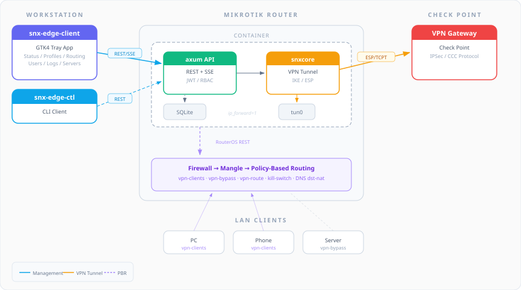

# snx-edge

[](https://github.com/happykust/snx-edge/actions/workflows/ci.yml)
[](https://github.com/happykust/snx-edge/actions/workflows/release.yml)
[](LICENSE)

Headless Check Point VPN client running inside a MikroTik container with a remote management API and a GTK4 tray application for Linux desktops.

## Overview

**snx-edge** moves the VPN termination point from your workstation to a MikroTik router. The VPN tunnel runs inside a lightweight Docker container on the router, and selective traffic routing is handled by RouterOS policy-based routing (PBR). You manage everything from a system tray app on your desktop.

<p align="center">
  
</p>

### Key Features

- **Headless VPN** — runs `snxcore` in a Docker container (Alpine, ~25 MB image)
- **Management REST API** — full control over VPN lifecycle, configuration, routing
- **Server-Sent Events** — real-time status updates pushed to all connected clients
- **RouterOS Integration** — automated PBR setup via RouterOS REST API (mangle, routes, NAT, DNS protection)
- **Multi-user RBAC** — admin / operator / viewer roles with granular permissions
- **GTK4 Tray Client** — libadwaita-based desktop app with profile editor, routing management, log viewer
- **Cross-compilation** — ARM64, ARMv7, x86_64 targets for MikroTik hardware
- **MFA Support** — challenge-response flow for multi-factor authentication
- **Kill Switch** — firewall rules prevent traffic leaks if the tunnel drops

## Components

| Component | Description | Runtime |
|---|---|---|
| **snx-edge-server** | Headless VPN client + Management API | Docker on MikroTik (Alpine, ARM64) |
| **snx-edge-client** | Tray app for remote management | Linux desktop (x86_64, GTK4/libadwaita) |

## Hardware Requirements

| Resource | Minimum | Recommended |
|---|---|---|
| CPU | ARMv8 (ARM64) or x86_64 | ARMv8 / x86_64 |
| RAM | 256 MB free | 512 MB+ |
| RouterOS | ≥7.23 stable with container support | ≥7.23 stable (7.22 breaks ip-rule for containers; ≤7.11 lacks TUN support) |
| Storage | ~50 MB for image + config | 200 MB |

ARMv7 is **not supported** — `snxcore`'s OpenSSL/SQLite stack requires a 64-bit toolchain. The server itself uses around 50 MB of RAM at idle; the rest is Alpine OS overhead, plus headroom for active VPN sessions.

Recommended MikroTik models: **hAP ax²**, **hAP ax³**, **RB4011** series, **CCR** series, and **CHR** virtual instances. Enable the `container` package and reboot before deploying.

## Quick Start (Docker)

### Prerequisites

- MikroTik router with RouterOS ≥7.23 stable and container support enabled
- Check Point VPN gateway credentials
- Docker (for local testing) or MikroTik's container runtime

### 1. Clone the repository

```bash
git clone --recurse-submodules https://github.com/happykust/snx-edge.git
cd snx-edge
```

### 2. Configure

```bash
cp docker/config.toml.example docker/config.toml
# Edit docker/config.toml with your VPN and RouterOS settings
```

### 3. Set environment variables

Copy the template and fill in real values:

```bash
cp docker/.env.example docker/.env
$EDITOR docker/.env
```

`docker/.env` is gitignored; never commit real secrets. Compose will refuse to start if `SNX_EDGE_JWT_SECRET`, `ROUTEROS_HOST`, `ROUTEROS_USER`, or `ROUTEROS_PASSWORD` are missing.

### 4. Run

```bash
cd docker
docker compose up -d
```

The server will be available at `http://localhost:8080`. The default admin account is created from `SNX_EDGE_ADMIN_USER` / `SNX_EDGE_ADMIN_PASSWORD` on first start.

### Container runtime

For **Docker/Compose**, the container runs with minimum capabilities:

| Capability | Why |
|---|---|
| `NET_ADMIN` | iptables MASQUERADE, TUN device control, `net.ipv4.ip_forward` |
| `NET_RAW` | TUN device packet inspection |

All other Linux capabilities are dropped (`cap_drop: ALL`), and `no-new-privileges:true` blocks setuid escalation.

> **RouterOS Container runtime:** Unlike Docker, RouterOS Container automatically exposes `/dev/net/tun` to containers running as `user=0:0` (root). No `--cap-add`, `--cap-drop`, or `--device` flags are needed — set `user="0:0"` in `/container/add`, and TUN support works out of the box. This requires RouterOS ≥7.23 stable.

## Building from Source

### Requirements

- Rust 1.85+ (edition 2024)
- For snx-edge-client: GTK4 4.12+, libadwaita 1.4+, D-Bus development libraries

### Server

```bash
cargo build --release -p snx-edge-server
```

### Client

```bash
# Install GTK4/libadwaita dev packages first:
# Fedora: dnf install gtk4-devel libadwaita-devel dbus-devel
# Ubuntu: apt install libgtk-4-dev libadwaita-1-dev libdbus-1-dev

cargo build --release -p snx-edge-client
```

### Cross-compilation (ARM64 for MikroTik)

```bash
rustup target add aarch64-unknown-linux-musl
cargo build --release --target aarch64-unknown-linux-musl -p snx-edge-server \
  --features snxcore/vendored-openssl,snxcore/vendored-sqlite
```

## Configuration

Server configuration is done via a TOML file. See [`docker/config.toml.example`](docker/config.toml.example) for all options.

| Section | Key settings |
|---|---|
| `[api]` | Listen address, TLS certificates, mTLS |
| `[auth]` | JWT secret (env), token TTLs, lockout policy |
| `[routeros]` | RouterOS host/credentials (env), address lists, routing table names |
| `[logging]` | Log level, ring buffer size, optional file output |

VPN profiles are managed through the API, not the config file.

## API Overview

All endpoints are prefixed with `/api/v1`. Authentication uses JWT Bearer tokens.

| Category | Endpoints |
|---|---|
| **Auth** | `POST /auth/login`, `POST /auth/refresh` |
| **Tunnel** | `POST /tunnel/connect`, `POST /tunnel/disconnect`, `GET /tunnel/status` |
| **Profiles** | CRUD on `/profiles`, cert upload, import/export |
| **Routing** | `/routing/clients`, `/routing/bypass`, `/routing/setup`, `/routing/diagnostics` |
| **Users** | CRUD on `/users`, `/users/me`, `/users/sessions` |
| **Events** | `GET /events` (SSE stream) |
| **Logs** | `GET /logs` (SSE stream), `GET /logs/history` |
| **Health** | `GET /health` (no auth) |

### Roles & Permissions

| Role | Capabilities |
|---|---|
| **admin** | Full access: VPN, config, routing setup/teardown, user management |
| **operator** | VPN connect/disconnect, routing client/bypass management, logs |
| **viewer** | Read-only: status, config, routes, logs |

## RouterOS Integration

snx-edge-server manages MikroTik routing rules via the RouterOS REST API:

- **Address lists** — `vpn-clients` (hosts routed through VPN) and `vpn-bypass` (exceptions)
- **Mangle rules** — mark connections and routes for policy-based routing
- **Routing table** — dedicated `vpn-route` table with gateway pointing to the container
- **Kill switch** — firewall rules to prevent traffic leaks
- **DNS protection** — redirect DNS queries from VPN clients, block DoT

All managed rules are tagged with `managed-by=snx-edge` comments for safe cleanup.

## Client Application

The GTK4 tray application provides:

- System tray icon with connection status
- VPN profile editor (connection settings, DNS, routing, security, IKE)
- Routing management (add/remove VPN clients and bypass addresses)
- User management (admin only)
- Real-time log viewer with level filtering
- Multi-server support with server picker

### Running the Client

```bash
snx-edge-client
```

Configuration is stored in `~/.config/snx-edge/client.toml`.

## Project Structure

```
snx-edge/
├── apps/
│   ├── snx-edge-server/       # Headless VPN server + API
│   │   ├── src/
│   │   │   ├── api/           # Axum route handlers
│   │   │   ├── routeros/      # RouterOS REST client & PBR provisioner
│   │   │   ├── config.rs      # TOML configuration
│   │   │   ├── db.rs          # SQLite user/session storage
│   │   │   ├── tunnel.rs      # VPN tunnel manager (snxcore wrapper)
│   │   │   └── ...
│   │   └── tests/
│   └── snx-edge-client/       # GTK4 tray application
│       └── src/
│           ├── ui/            # GTK4/libadwaita windows
│           ├── api.rs         # HTTP client for server API
│           ├── auth.rs        # JWT + keyring management
│           ├── sse.rs         # SSE event stream
│           ├── tray.rs        # System tray (ksni)
│           └── ...
├── docker/                    # Dockerfile, compose, config example
├── vendor/snx-rs/             # Upstream VPN library (git submodule)
└── Cargo.toml                 # Workspace root
```

## Troubleshooting

| Symptom | Likely cause / fix |
|---|---|
| Container does not start on RouterOS | Container support is not enabled. Install the `container` package, set `/container/config set registry-url=https://registry-1.docker.io tmpdir=disk1/pull`, reboot, then retry. |
| `iptables-legacy: not found` in logs | Old base image. Pull `latest` (Alpine 3.23+); pre-3.23 images shipped only `iptables-nft`, which does not work in MikroTik containers. |
| DNS does not resolve after connect | The DNS dst-NAT rule did not apply. Check the provisioner ran successfully (`/api/v1/routing/diagnostics`) and that `dns-dst-nat` is enabled. Verify your VPN clients are in the `vpn-clients` address list. |
| TLS handshake fails against the Check Point gateway | Corporate CA missing, time skew, or self-signed gateway. Check the system clock first. As a last resort, set `[security].allow_no_cert_check = true` in `config.toml` and `no_cert_check = true` on the profile — only on networks where you trust the path to the gateway. |
| Server exits immediately with "JWT secret missing" | Env var name configured in `[auth].jwt_secret_env` does not match the actual environment variable. Default is `SNX_EDGE_JWT_SECRET`. |
| `MASQUERADE: command not found` or `permission denied` from iptables | Container started without `NET_ADMIN`. Re-check `cap_add` in compose, or the equivalent on RouterOS. |
| Healthcheck reports unhealthy but API works | Healthcheck uses `curl http://localhost:8080/api/v1/health`. If you enabled TLS on the management port, the healthcheck needs to be updated to use `https://` and the `--cacert` flag, or change `[api].listen` to bind plain HTTP on `127.0.0.1` for the healthcheck. |

## Security

snx-edge handles VPN credentials, JWT signing material, and RouterOS admin credentials. For responsible disclosure of security vulnerabilities, see [SECURITY.md](SECURITY.md).

Production hardening checklist (see `docker/config.toml.example` for full details):

- `[security].allow_no_cert_check = false` — refuse profiles that disable certificate verification of the Check Point gateway.
- `[security].profile_encryption_key_env = "SNX_EDGE_PROFILE_KEY"` — encrypt VPN credentials at rest in SQLite.
- `[api].tls_cert` / `[api].tls_key` — terminate TLS on the management API.
- `[api].tls_client_ca` — require client certificates (mTLS) when exposing the API beyond the local subnet.
- Set strong `SNX_EDGE_JWT_SECRET` (>= 32 random bytes; generate with `openssl rand -base64 32`).
- Restrict the RouterOS user to only the routing/firewall trees the provisioner needs.

## Contributing

See [CONTRIBUTING.md](CONTRIBUTING.md) for development setup and guidelines.

## Acknowledgments

- [snx-rs](https://github.com/ancwrd1/snx-rs) — the upstream Check Point VPN client library that powers the VPN core
- [MikroTik](https://mikrotik.com/) — RouterOS container support makes this project possible

## License

This project is licensed under the [GNU Affero General Public License v3.0](LICENSE).
